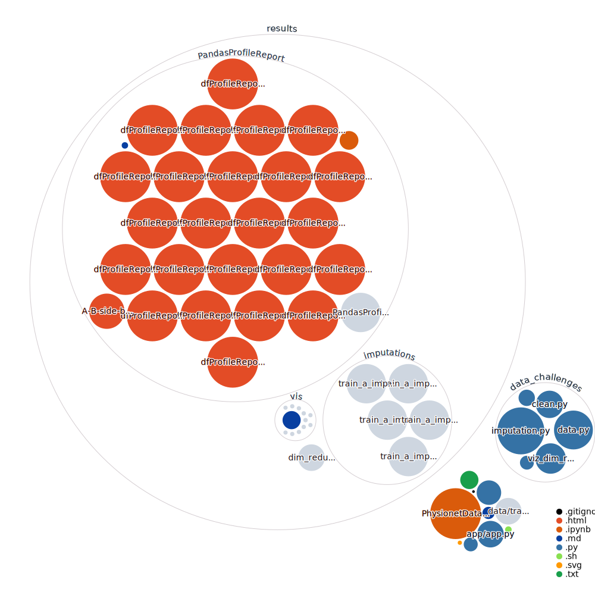

# Uni WS 2021/22 Data Challenges

Dataset: https://physionet.org/content/challenge-2019/1.0.0/

## [Pandas Profiling Reports](results/PandasProfileReport)

Some of the html reports generated by
[pandas-profiling](https://github.com/pandas-profiling/pandas-profiling)
are very big (~100 MB). You can open them with e.g. Firefox.

## Imputer

- Package
    - https://pypi.org/project/fancyimpute/
    - https://www.tensorflow.org/probability/api_docs/python/tfp/sts/impute_missing_values
- Repos
    - https://github.com/rosinality/imputer-pytorch
    - https://github.com/caow13/BRITS
    - https://github.com/ssandyshaa/BRITS
    - https://github.com/jsyoon0823/GAIN
    - https://github.com/Rype80/WGAINGP
    - https://github.com/DaanSc/WGAIN-GP
- Julia
    - https://github.com/invenia/Impute.jl

## Sitemap Markdowns

- [README.md](README.md)
- [results/PandasProfileReport/README.md](results/PandasProfileReport/README.md)
- [results/vis/README.md](results/vis/README.md)

## Sitemap HTMLs

- results/PandasProfileReport
	- [A-B-side-by-side](results/PandasProfileReport/A-B-side-by-side.html)
	- [dfProfileReport-MultiIndex-A](results/PandasProfileReport/dfProfileReport-MultiIndex-A.html)
	- [dfProfileReport-MultiIndex-B](results/PandasProfileReport/dfProfileReport-MultiIndex-B.html)
	- [dfProfileReport-MultiIndex-minimal](results/PandasProfileReport/dfProfileReport-MultiIndex-minimal.html)
	- [dfProfileReport-agg-count-A](results/PandasProfileReport/dfProfileReport-agg-count-A.html)
	- [dfProfileReport-agg-count-B](results/PandasProfileReport/dfProfileReport-agg-count-B.html)
	- [dfProfileReport-agg-count-all](results/PandasProfileReport/dfProfileReport-agg-count-all.html)
	- [dfProfileReport-agg-max-A](results/PandasProfileReport/dfProfileReport-agg-max-A.html)
	- [dfProfileReport-agg-max-B](results/PandasProfileReport/dfProfileReport-agg-max-B.html)
	- [dfProfileReport-agg-max-all](results/PandasProfileReport/dfProfileReport-agg-max-all.html)
	- [dfProfileReport-agg-mean-A](results/PandasProfileReport/dfProfileReport-agg-mean-A.html)
	- [dfProfileReport-agg-mean-B](results/PandasProfileReport/dfProfileReport-agg-mean-B.html)
	- [dfProfileReport-agg-mean-all](results/PandasProfileReport/dfProfileReport-agg-mean-all.html)
	- [dfProfileReport-agg-mean-med-A](results/PandasProfileReport/dfProfileReport-agg-mean-med-A.html)
	- [dfProfileReport-agg-mean-med-B](results/PandasProfileReport/dfProfileReport-agg-mean-med-B.html)
	- [dfProfileReport-agg-median-A](results/PandasProfileReport/dfProfileReport-agg-median-A.html)
	- [dfProfileReport-agg-median-B](results/PandasProfileReport/dfProfileReport-agg-median-B.html)
	- [dfProfileReport-agg-median-all](results/PandasProfileReport/dfProfileReport-agg-median-all.html)
	- [dfProfileReport-agg-min-A](results/PandasProfileReport/dfProfileReport-agg-min-A.html)
	- [dfProfileReport-agg-min-B](results/PandasProfileReport/dfProfileReport-agg-min-B.html)
	- [dfProfileReport-agg-min-all](results/PandasProfileReport/dfProfileReport-agg-min-all.html)
	- [dfProfileReport-agg-min-max-A](results/PandasProfileReport/dfProfileReport-agg-min-max-A.html)
	- [dfProfileReport-agg-min-max-B](results/PandasProfileReport/dfProfileReport-agg-min-max-B.html)
	- [dfProfileReport-agg-min-max-mean-med-A](results/PandasProfileReport/dfProfileReport-agg-min-max-mean-med-A.html)
	- [dfProfileReport-agg-min-max-mean-med-B](results/PandasProfileReport/dfProfileReport-agg-min-max-mean-med-B.html)
- results/dim_redus
	- [viz_dimred_interactive](results/dim_redus/viz_dimred_interactive.html)

## Repo Visualizer

