# Dimensionality Reduction Visualizations

## Dimensionality Reduction

|                                                          |                                                      |
|----------------------------------------------------------|------------------------------------------------------|
| **PACMAP**                                               |                                                      |
| pacmap--sample0.5                                        | pacmap-i_simple_group_age_mean-sample0.5             |
| [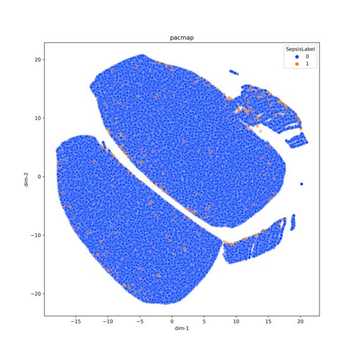](pacmap--sample0.5.png)                               | [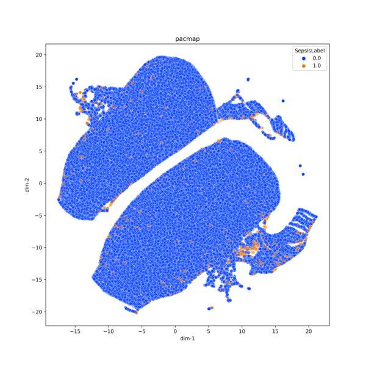](pacmap-i_simple_group_age_mean-sample0.5.png)    |
| pacmap-i_simple_group_age_ranges_mean-sample0.5          | pacmap-i_simple_group_gender_mean-sample0.5          |
| [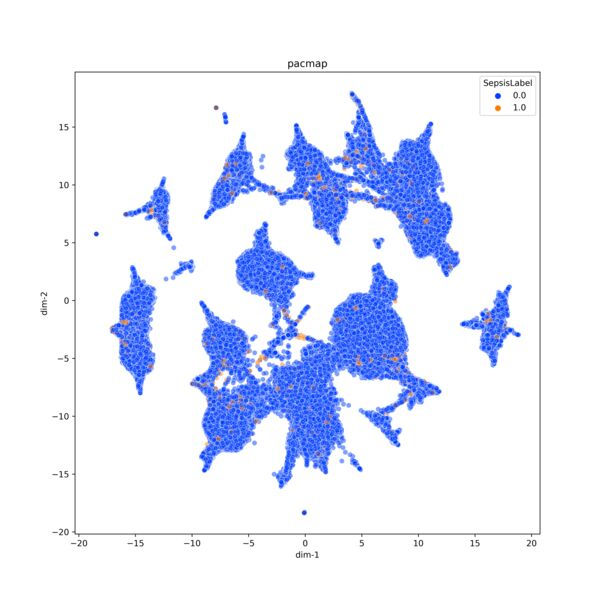](pacmap-i_simple_group_age_ranges_mean-sample0.5.png) | [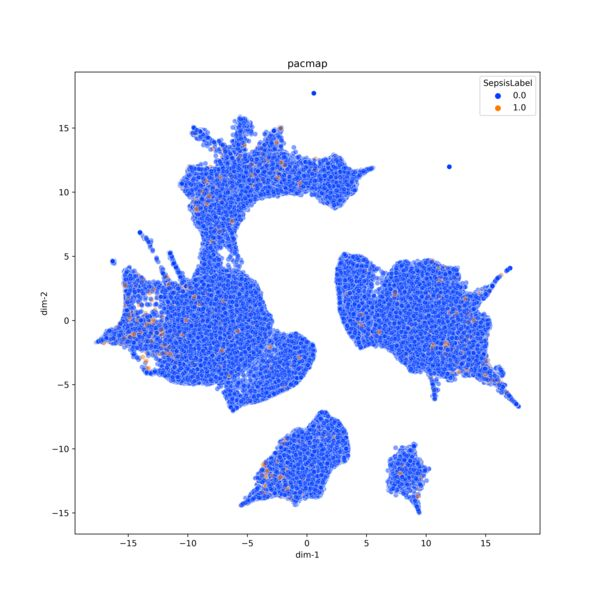](pacmap-i_simple_group_gender_mean-sample0.5.png) |
| pacmap-i_simple_group_patient_mean-sample0.5             | pacmap-i_simple_mean-sample0.5                       |
| [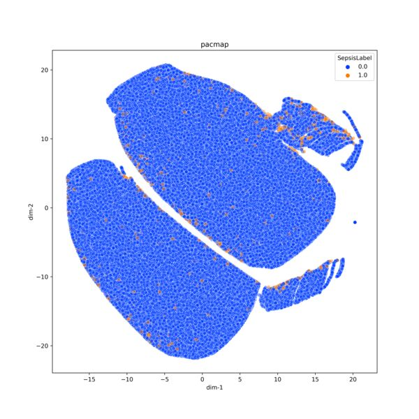](pacmap-i_simple_group_patient_mean-sample0.5.png)    |               |
| pacmap-i_simple_mean-sample0.25                          | pacmap-i_simple_mean-sample1.0                       |
| [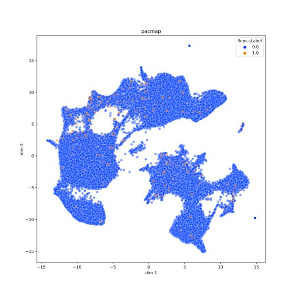](pacmap-i_simple_mean-sample0.25.png)                 |               | 
| pacmap-i_simple_most_frequent-sample0.5                  |                                                      |
| [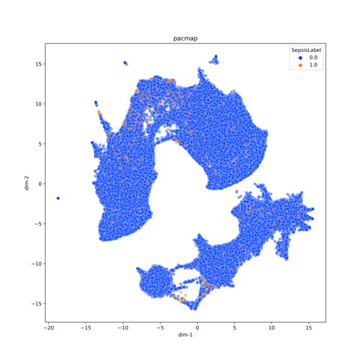](pacmap-i_simple_most_frequent-sample0.5.png)         |                                                      |
| pacmap-i_simple_group_gender_mean-sample0.1.png          | pacmap-i_simple_mean-sample0.01.png                  |
| [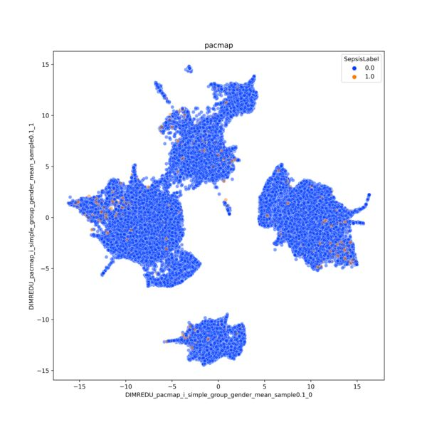](pacmap-i_simple_group_gender_mean-sample0.1.png)     | [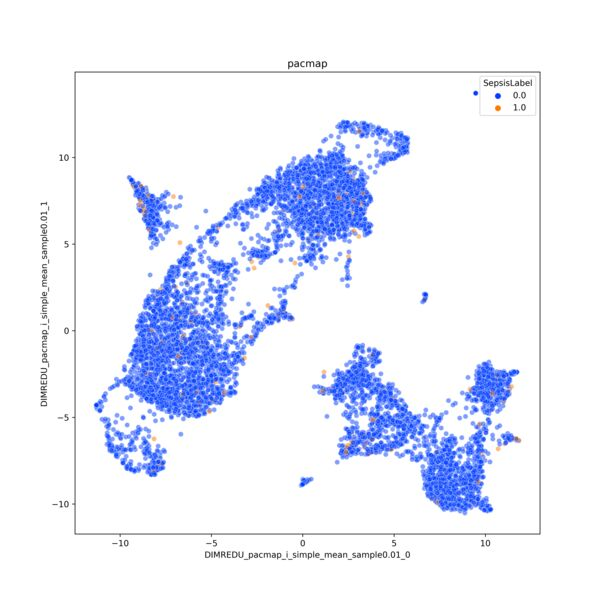](pacmap-i_simple_mean-sample0.01.png)             |
| pacmap-i_simple_mean-sample0.1.png                       | pacmap-i_simple_median-sample0.1.png                 |
| [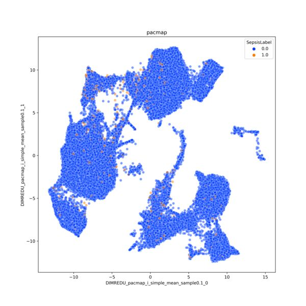](pacmap-i_simple_mean-sample0.1.png)                  | [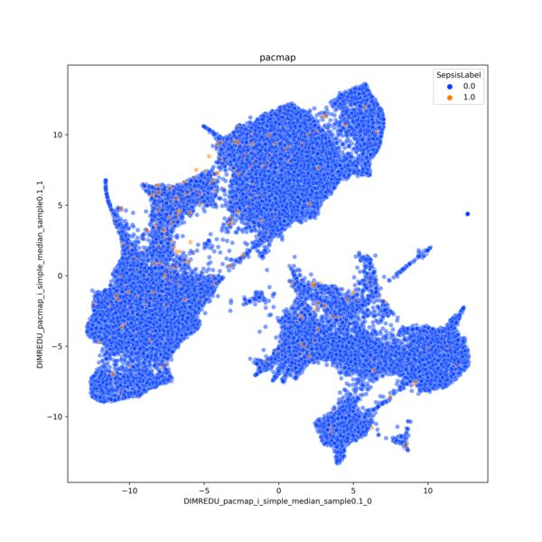](pacmap-i_simple_median-sample0.1.png)            |
| pacmap-i_simple_most_frequent-sample0.1.png              |                                                      |
| [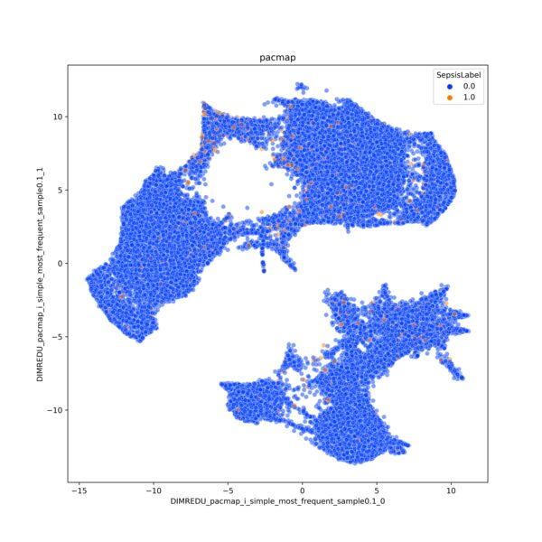](pacmap-i_simple_most_frequent-sample0.1.png)         |                                                      |
| **T-SNE**                                                |                                                      |
| tsne-i_simple_mean-sample0.5                             |                                                      |
| [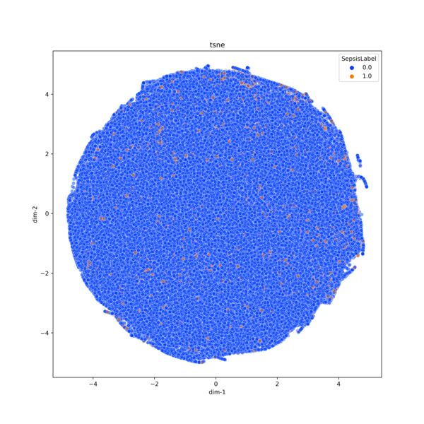](tsne-i_simple_mean-sample0.5.png)                    |                                                      |

## Clustering

|                                                                       |                                                                    |
|-----------------------------------------------------------------------|--------------------------------------------------------------------|
| **DBSCAN**                                                            |                                                                    |
| dbscan-i_simple_mean_pacmap                                           |                                                                    |
| dbscan-i_simple_mean_pacmap.png                                       | dbscan-eps0.5-pacmap-i_simple_group_gender_mean-sample0.1.png      |
| [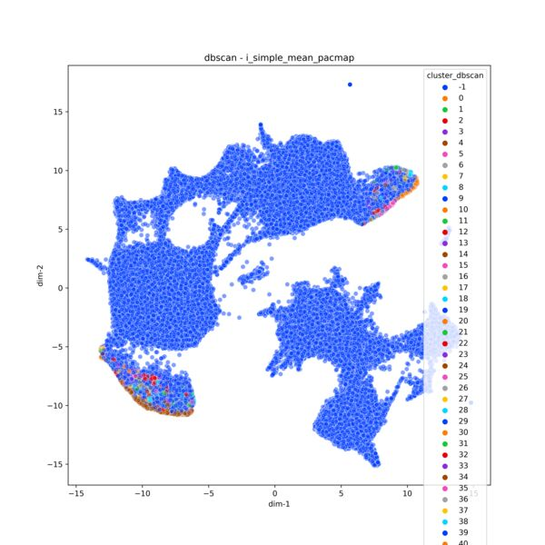](dbscan-i_simple_mean_pacmap.png)                                  | [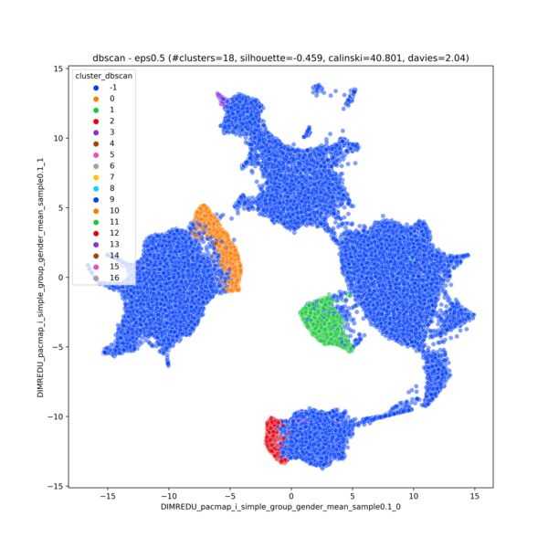](dbscan-eps0.5-pacmap-i_simple_group_gender_mean-sample0.1.png) |
| dbscan-eps0.5-pacmap-i_simple_mean-sample0.1.png                      | dbscan-eps0.5-pacmap-i_simple_median-sample0.1.png                 |
| [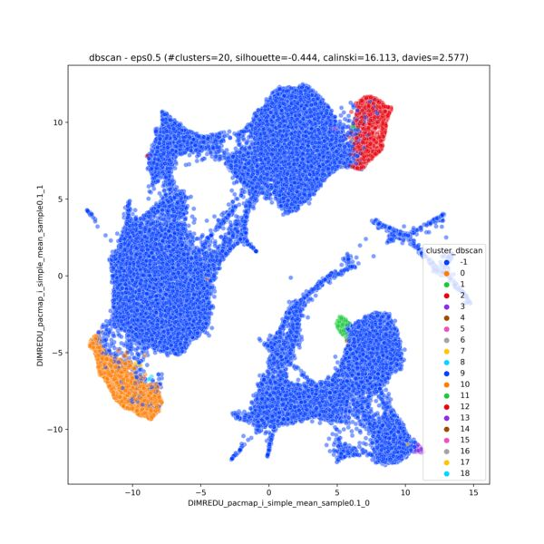](dbscan-eps0.5-pacmap-i_simple_mean-sample0.1.png)                 | [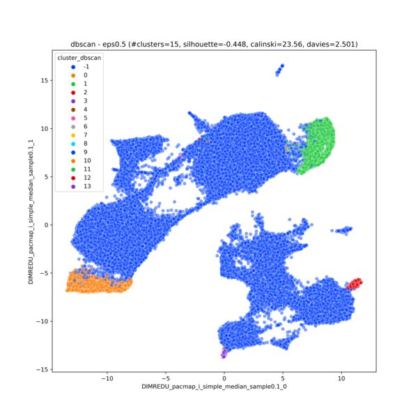](dbscan-eps0.5-pacmap-i_simple_median-sample0.1.png)            |
| dbscan-eps0.5-pacmap-i_simple_most_frequent-sample0.1.png             |                                                                    |
| [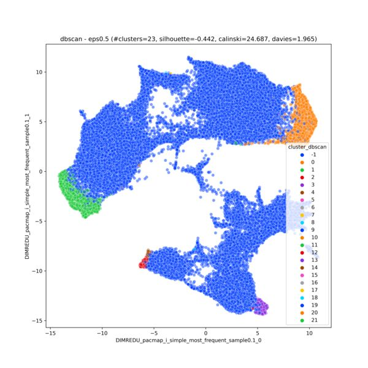](dbscan-eps0.5-pacmap-i_simple_most_frequent-sample0.1.png)        |                                                                    |
| **k-means**                                                           |                                                                    |
| kmeans-clusters2-pacmap-i_simple_group_gender_mean-sample0.1.png      | kmeans-clusters2-pacmap-i_simple_mean-sample0.1.png                |           
| [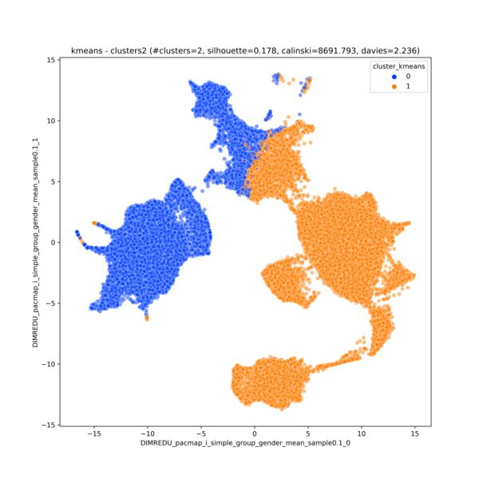](kmeans-clusters2-pacmap-i_simple_group_gender_mean-sample0.1.png) | [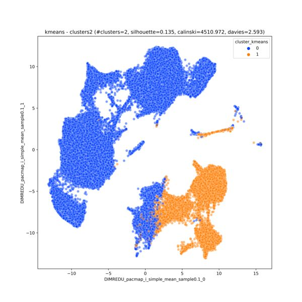](kmeans-clusters2-pacmap-i_simple_mean-sample0.1.png)           |           
| kmeans-clusters2-pacmap-i_simple_median-sample0.1.png                 | kmeans-clusters2-pacmap-i_simple_most_frequent-sample0.1.png       |  
| [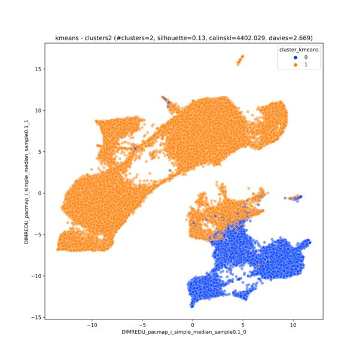](kmeans-clusters2-pacmap-i_simple_median-sample0.1.png)            | [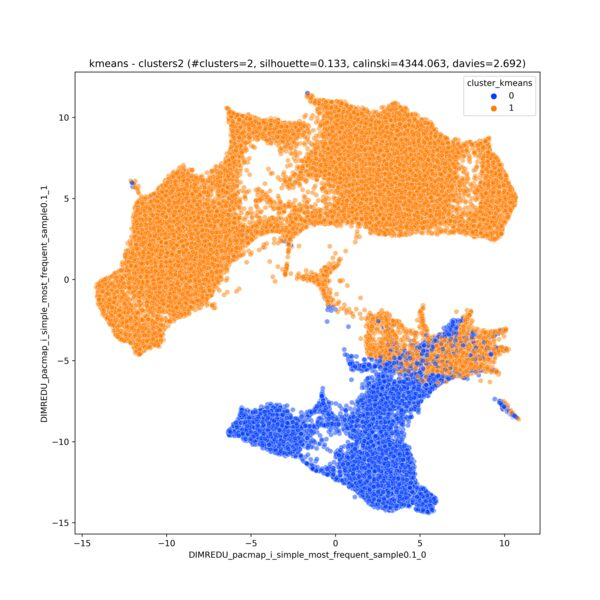](kmeans-clusters2-pacmap-i_simple_most_frequent-sample0.1.png)  |  

<!--
<table>
    <tr>
        <td>
            
        </td>
        <td>
            
        </td>
    </tr>
    <tr>
        <td>
            
        </td>
        <td>
            
        </td>
    </tr>
    <tr>
        <td>
            
        </td>
        <td>
            
        </td>
    </tr>
    <tr>
        <td>
            
        </td>
        <td>
            
        </td>
    </tr>
    <tr>
        <td>
            
        </td>
    </tr>
</table>
-->
